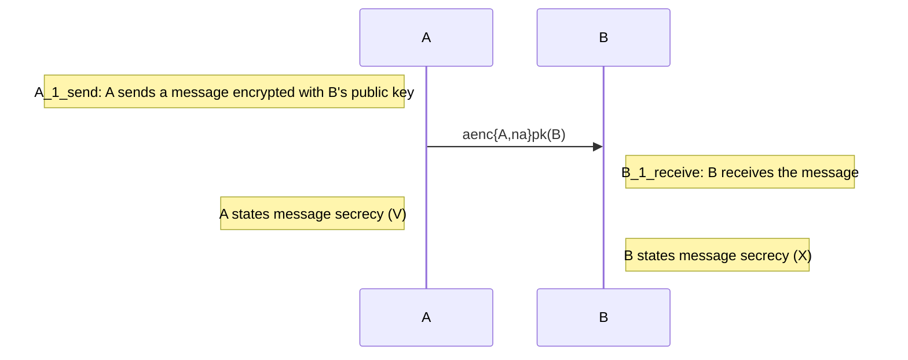

# Index
- [Index](#index)
  - [What's Tamarin?](#whats-tamarin)
  - [How does it work?](#how-does-it-work)
  - [How to write a protocol in Tamarin?](#how-to-write-a-protocol-in-tamarin)
    - [Function](#function)
    - [Equation](#equation)
    - [How to model a PKI?](#how-to-model-a-pki)
  - [Modelling a simple protocol in Tamarin](#modelling-a-simple-protocol-in-tamarin)
  - [How to define security properties](#how-to-define-security-properties)
    - [Syntax](#syntax)
    - [Expressing secrecy in Tamarin](#expressing-secrecy-in-tamarin)
      - [Example](#example)
    - [Exploring the Graphical User Interface](#exploring-the-graphical-user-interface)
    - [... and lemmas?](#-and-lemmas)
  - [Appendix](#appendix)
    - [Binding expression using let](#binding-expression-using-let)
    - [Constants](#constants)
    - [Restrictions](#restrictions)
## What's Tamarin?
Tamarin is a formal method tool, i.e. a tool used to prove the *formal* correctness of a protocol.  
The protocol and the adversary capabilities are represented by a *labelled multi-set rewriting rules*.   
## How does it work?
In Tamarin there are two concepts:
1. The ***system state***: is a multiset of *facts* (the initial system state is the empty multiset), i.e. a symbolic representation of:

  - the adversary's knowledge

  - the message on the network
  - information about freshly generated values
  - protocol's state   

2. The **rules**: define how to migrate from one state to another. A rule occurs in the form:

> *rule Example_rule:
> [prerequisites] --[label]-> [conclusion]*

    NB: [prerequisites], [label] and [conclusion] are called facts. 
    Facts are of the form F(t1,...,tn) and have fixed arity. T1,...,tn are called terms. 
  In the previous example, the rule is applied iff the prerequisites are satisfied, thus iff the *[prerequisites]* are present in the current state.  
  Moreover, after the rule is spent, *[label]* is appended to the *trace*, and *[conclusion]* substitutes *[prerequisites]* in the state.  
  Rules without labels only affect the system state and not the trace.

2. ***the  trace***: is the sequence of transitions (e.g. the sequence of the label of the applied rules). Traces are used to verify the *security properties*.  

## How to write a protocol in Tamarin?

To write down a protocol we need:
1. functions;

2. equations;
3. a set of rules that model PKI (public key infrastructure);
4. a set of rules that model the behaviour of the agents.

### Function

Tamarin supports a set of **built-in** function symbols and additional **user-defined** function symbols may be created.  
The only functions presented in all the Tamarin files are:
- Pairing functions
  > *pair(x,y)*
- Projection functions
  > *fst(pair(x,y))=x* or *fst(<x,y>)=x*
  >  
  > *snd(pair(x,y))=y* or *snd(<x,y>)=y*

Additional *built-in* functions can be used by including other theories, for example, *hashing*,*asymmetric-encryption*, *etc...*  

A function is declared in the following way:
> *functions: f1/a1,...,fn/an*  

    NB: ai,...,an are the arity of the function and must be consistent everywhere in the file.

### Equation

The equation expresses a relation between the *functions*.  
For instance, having the following function:
> functions: enc/2, dec/2

espressing respectively an encryption and a decryption function. It's thus possible building the following equation:
> *equation: dec(enc(mess,key),key) = mess*

    NB: the equations must be convergent and have the Finite Variant Property.

### How to model a PKI?

Tamarin works in a **symbolic model** of security protocols. This means that cryptographic messages are modelled as *terms* instead of bit strings.  
We can thus overlook the implementation of the cryptographic primitives.

To model a PKI we need:
- Three functions:  
  >*functions: aenc/2, adec/2, pk/1*

  1. *aenc/2* &rarr; function for *asimmetric encryption* - arity 2
  2. *adec/2* &rarr; function for *asimmetric decryption* - arity 2
  2. *pk/1* &rarr; function tp *bind* secret and public asymmetric keys - arity 1  

- One equation:
  > *adec(aenc(m,k),k)=m*

  1. *adec(aenc(m,k),k)=m* &rarr; equation to *link* encryption and decryption

- Three rules (one for the key leakage):
  > *rule Register_pk:  
  >  [ Fr(~ltk) ]  
  -->  
  >[ !Ltk($A, ~ltk), !Pk(\$A, pk(~ltk)) ]*

  >*rule Get_pk:  
    [ !Pk(A, pk) ]  
    -->  
    [ Out(pk) ]*

    >*rule Reveal_ltk:  
    [ !Ltk(A, ltk) ]  
    --[ LtkReveal(A) ]->  
    [ Out(ltk) ]*  

    1. This rule first generates a fresh term ltk (\~ express a fresh term) and save (! expresses a persistent fact) the fact that
      - A's private key is ltk
      - A's public key is Pk($A, pk(~ltk)) ($ denotes a public term)
    2. This rule allows a user to get the public key of an agent. The knowledge is represented by adding in the out channel the agent's public key.
    3. This is perhaps the most interesting rule. It models the leakage of a long-term key. This rule is useful to demonstrate  
    some security properties, thus we need a label.

## Modelling a simple protocol in Tamarin

We want to model this toy protocol:

We need three rules:

1.  > rule RULE_C1:
    [ Fr(~k),        *// choose fresh key*
      !Pk($S, pkS)   *// lookup public-key of server*
    ]
  -->
    [ Client_1( \$S, ~k )      *// Store server and key for next step of thread*
    , Out( aenc{'1', ~k}pkS )  *// Send the encrypted session key to the server*
                               *// We add the tag '1' to the request to allow*
                               *// the server to check whether the decryption*
                               *// was successful.*
    ]*
  
2.  > rule Serv_1:
    [ !Ltk(\$S, ~ltkS)                          *// lookup the private-key*
    , In( request )                            *// receive a request*
    ]
  --[ Eq(fst(adec(request, ~ltkS)), '1')      *// first request element must be 1 (?) and*
    , AnswerRequest($S, snd(adec(request, ~ltkS)))   *// Explanation below*
    ]->
    [ Out( h(snd(adec(request, ~ltkS))) ) ]    *// Return the hash of the decrypted request.*

3.  >rule Client_2:
    [ Client_1(S, k)   *// Retrieve server and session key from previous step*
    , In( h(k) )       *// Receive hashed session key from network*
    ]
  --[ SessKeyC( S, k ) ]-> *// State that the session key 'k'*
    []       

## How to define security properties

In Tamarin, the security properties are defined through *lemmas*.
There are two different kinds if properties:
1. **Trace properties**: thanks to the labels (also called actions) the system is able to reason about the protocol's behaviour.
   A trace property is a set of traces defined using first-order logic formulas over *action facts* and timepoints.
   For example:  

   > lemma one_smaller_two:
    "All x y #i. B(x,y)@i ==> Smaller(x,y)"  

    expresses that for every x and y (terms) and #i (index in the trace) if B(x,y) occurs at index i (indicated with @i) then Smaller(x,y).
2. **Equivalence properties**: these properties are specified using the *diff* operator. They reason about two different systems (for example two instances of a protocol), by showing that an intruder cannot distinguish these two systems.
In this example the agent generates a public key and output it. Then he chooses two freshes values and reveal one of it encrypting either the first or the second fresh value
    >    rule Example:
          [ Fr(~ltk)
          , Fr(~a)
          , Fr(~b) ]
        --[ Secret( ~b ) ]->
          [ Out( pk(~ltk) )
          , Out( ~a )
          , Out( aenc( **diff**(\~a,~b), pk(~ltk) ) )
          ]  

    In the following *lemma* the intruder cannot compute ~b as formalized by the following lemma:
    > lemma B_is_secret:
  " /* The intruder cannot know ~b: */
    All B #i. (
      /* ~b is claimed secret implies */
      Secret(B) @ #i ==>
      /* the adversary does not know '~b' */
      not( Ex #j. K(B) @ #j )
)
  

        NB: the attacker may take the output ~a, encrypt it with the public key and compare it to the published ciphertext.

### Syntax
  - **All**     for universal quantification, temporal variables are prefixed with #
  - **Ex**       for existential quantification, temporal variables are prefixed with #
  - **==>**      for implication
  - **&**        for conjunction
  - **|**        for disjunction
  - **not**      for  negation

  - **f @ i**    for action constraints, the sort prefix for the temporal variable 'i'
           is optional

  - **i < j**    for temporal ordering, the sort prefix for the temporal variables 'i'
           and 'j' is optional

  - **#i = #j**  for an equality between temporal variables 'i' and 'j'
  - **x = y**    for an equality between message variables 'x' and 'y'
  - **Pred(t1,..,tn)** as syntactic sugar for instantiating a predicate Pred for the terms t1 to tn

### Expressing secrecy in Tamarin 
We need the following **built-in** rule to model the Dolev-Yao knowledge:
> *rule isend:
   [ !KU(x) ]
 --[  K(x)  ]-->
   [ In(x)  ]*

   

To specify the property that a message x is secret, the idea is to label the key rules of the protocol with a *Secret action*. 
We then specify a *secrecy* lemma that states whenever the Secret(x) action occurs at timepoint i, the adversary *does not know x* (we represent this using the *isend* rule).
In Tamarin:
> *lemma secrecy:
  "All x #i.
    Secret(x) @i ==> not (Ex #j. K(x)@j)"*
#### Example
A sends a message encrypted with B’s public key to B. Both agents claim secrecy of a message, *but only agent A’s claim is true*. 
To distinguish between the two claims we add the action facts Role('A') (respectively Role('B')) to the rule modeling role A (respectively to the rule for role B). We then specify two secrecy lemmas, one for each role.

    NB: In this example, the lemma secret_A holds as the initiator generated the fresh value, while the responder has no guarantees, i.e., lemma secret_B yields an attack.

See the source code [here](./Theories/simple_secrecy.spthy).

### Exploring the Graphical User Interface

To prove if our lemmas are correct we have to execute the following command line:
> *tamarin-prover interactive <my_theory.spthy>*

On the left of the screen, are displayed the following items:
- **Message theory** : shows this subcategory:
  - Signature:  functions and equations (both user-defined or importent using built-ins)
  - Construction rules: rules that describe the function that the adversary can use
  - Deconstruction rules: rules that describe which terms the adversary can extract from larger terms by applying functions
- **Multiset rewriting rules**: shows the protocol's rewriting rules
- **Raw sources** and **refined sources**: shows how Tamarin precomputes case distinctions. A case distinction gives all the possible source for a fact. In a nutshell, it precomputes all the rules that produce a fact. These rules will be used during Tamarin's backward search.

### ... and lemmas?
To prove a lemma we have to click on **sorry** (express that the proof has not starded yet) on the left of the page. 
A proof always starts with either a:
- **simplification**(default strategy): translates the lemmas into an initial constraint system to be solved
- **induction**: which generates the necessary constraints to prove the lemma using induction on the length of the trace

## Appendix

### Binding expression using let
A term may occur multiple times witin the same rule. Tamarin offers support for *let ... in* as follow:
> *rule MyRuleName:
    let foo1 = h(bar)
        foo2 = <'bars', foo1>
        ...
        var5 = pk(~x)
    in
    [ ... ] --[ ... ]-> [ ... ]*

These let-binding expressions are used to specify local terms within the rule. The left-hand side of the *=* must be a variable and the right-hand side is an arbitrary term. 

### Constants
### Restrictions
